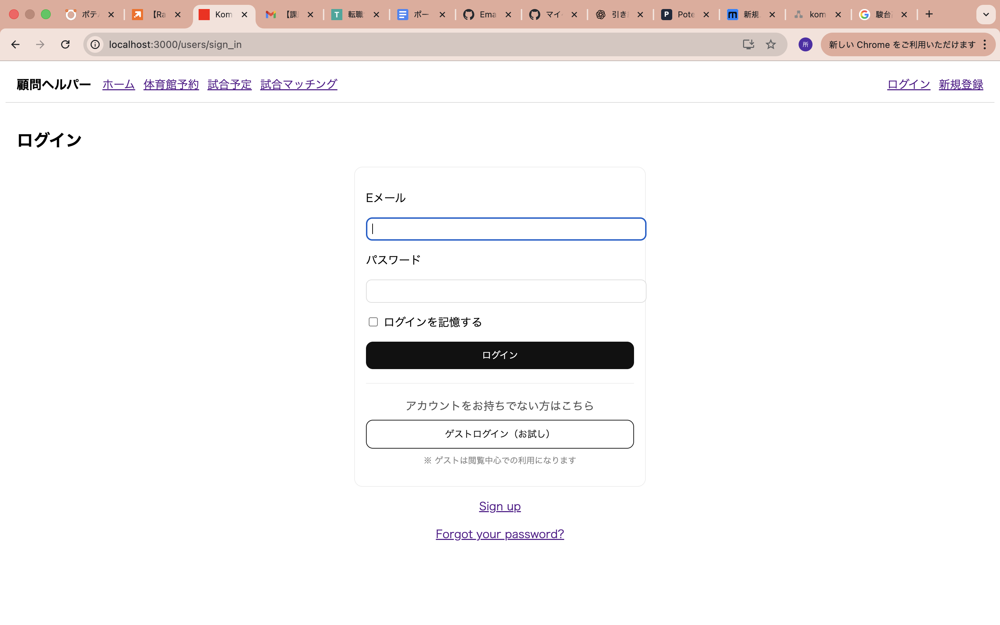
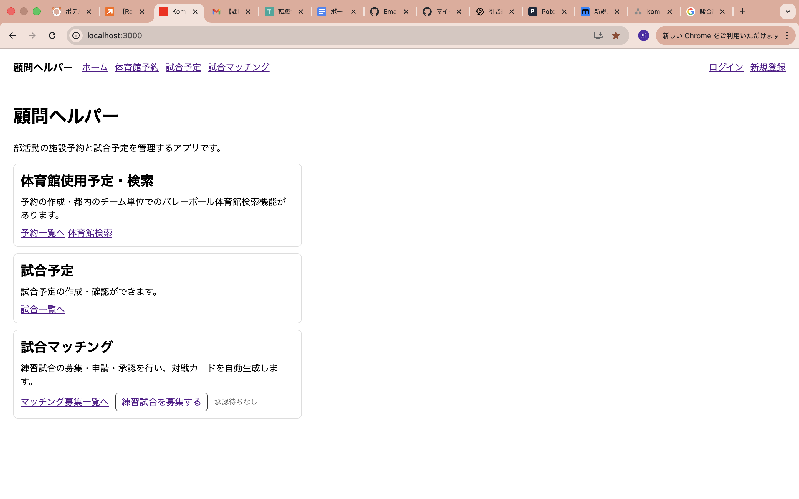
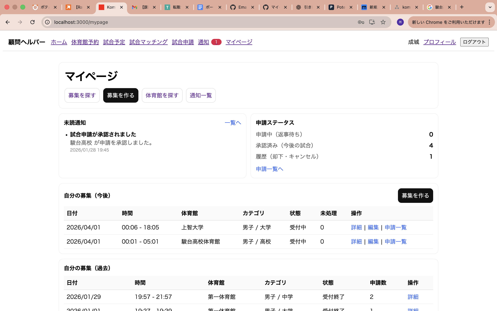
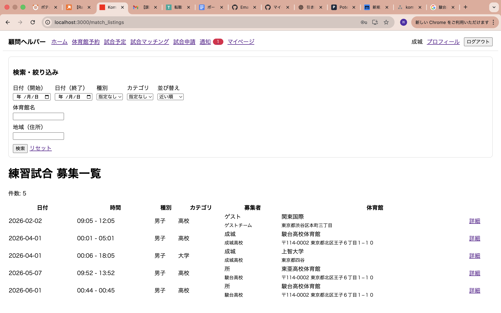
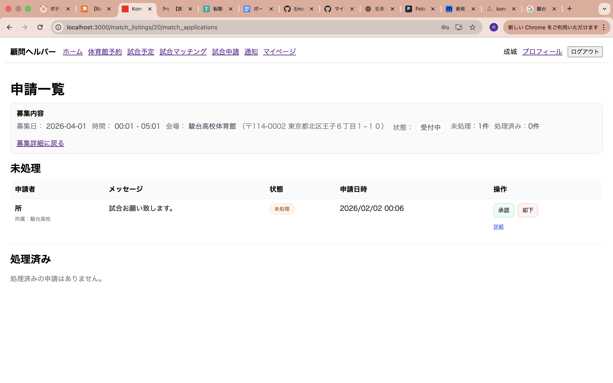
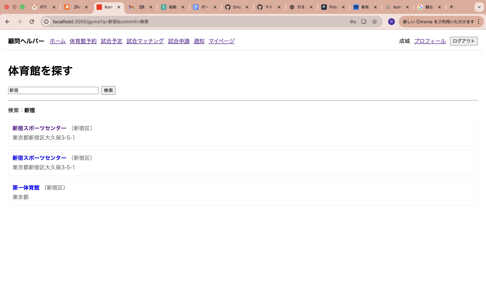
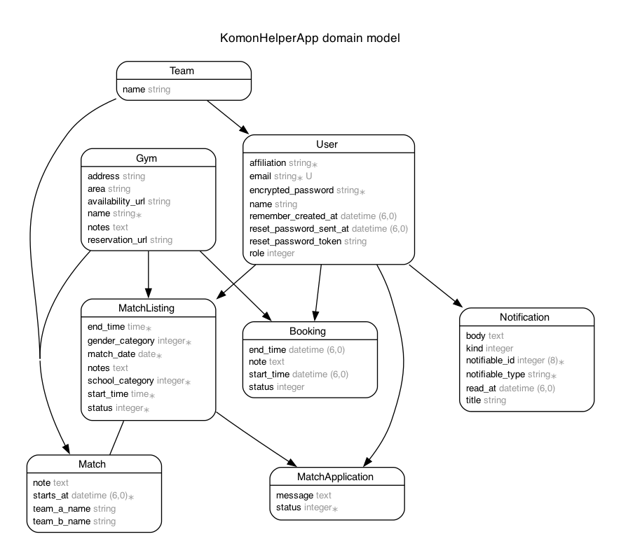

# 顧問ヘルパー（Komon Helper App）

部活動における **体育館予約管理** と **練習試合の募集・調整** を、  
顧問・コーチ目線で一元管理できるWebアプリです。

施設予約と対外試合の情報を1か所に集約し、  
日々の部活動運営にかかる調整コストを減らすことを目的としています。

---

## アプリの概要

- 顧問・コーチが体育館（施設）の予約を作成・管理できる
- 練習試合の募集を作成し、相手校からの申請〜承認までを管理できる
- 予約に使える公共体育館を **あいまいなエリア入力で検索**し、公式予約ページへ誘導できる（MVP構成）

---

## デモ（ゲストログイン）

開発環境では、動作確認用にゲストログインを用意しています。

- email: `tokohirohiroto@gmal.com`
- password: `111111`

※ ゲストユーザーは `name / affiliation` を事前に設定し、  
　 実運用に近い操作ができる状態にしています。

---

## アプリのスクリーンショット

- ログイン画面  
  

- ホーム画面（未ログインで閲覧可）  
  

- マイページ  
  

- 練習試合募集一覧 / 詳細  
  

- 申請一覧（承認 / 却下）  
  

- 体育館検索（あいまい検索）  
  

---

## アプリの使い方

### 1. ログイン
- 未ログインで閲覧できるのは `/`（home#index）のみ
- それ以外のページは `authenticate_user!` によりログイン必須

---

### 2. 体育館予約管理（Booking）
1. 予約一覧から「予約を作成」
2. 体育館・開始時間・終了時間・メモを入力
3. ステータスにより予約状況を管理

---

### 3. 練習試合募集・申請（MatchListing / MatchApplication）
1. 顧問が練習試合募集を作成
2. 相手校が募集に対して申請
3. 申請一覧画面から **承認 / 却下**
4. 承認された場合、試合が成立（※MVP段階）

---

### 4. 体育館検索（Gym検索：MVP）
1. エリア名（例：新宿、渋谷、世田谷）をあいまい入力
2. 体育館候補一覧を表示
3. 公式予約ページ・空き確認ページへ誘導  
   ※ 空き状況の判定は行わず、公式サイトでの確認を前提としています

---

## なぜこのアプリを作ったか（動機・背景）

部活動運営では、顧問・コーチが

- 体育館や施設の予約管理
- 練習試合の相手探し・日程調整
- 急な予定変更への対応

を個別に行う必要があり、情報管理の負担が大きいと感じていました。

そこで、  
**「施設予約」と「練習試合調整」を一元管理できる仕組み**を作ることで、  
日々の運用コストを下げることを目的に本アプリを開発しました。

---

## 工夫したところ（技術的なポイント）

- **Deviseによる認証管理**
  - 未ログイン時に閲覧可能な画面を `home#index` のみに制限
- **ゲストログイン機能**
  - 固定ユーザーに `sign_in` する方式で実装し、デモ操作を容易に
- **enumによる状態管理**
  - 予約・申請を `pending / approved / rejected / canceled` などで表現し、業務フローを明確化
- **Gym検索のMVP設計**
  - 候補提示＋公式予約ページ誘導にスコープを絞り、最短で価値提供できる形にした
- **Git運用**
  - 機能単位で feature ブランチを作成し、PRを通して main にマージ

---

## 使用技術

- Ruby
- Ruby on Rails 7.2.3
- Devise（認証）
- PostgreSQL
- HTML / ERB / CSS
- Git / GitHub

---

## ER図（MVP構成）



### 主なテーブル
- users（顧問・コーチ）
- gyms（体育館マスタ）
- bookings（体育館予約）
- match_listings（練習試合募集）
- match_applications（募集への申請）
- matches（成立した試合）

※ 本ER図は、現在実装されているMVP機能に基づいた構成です。

---

## セットアップ手順（開発環境）

```bash
git clone https://github.com/tokoro11/komon_helper_app.git
cd komon_helper_app

bundle install
rails db:create
rails db:migrate

rails s
